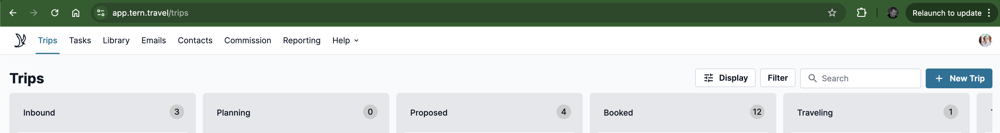
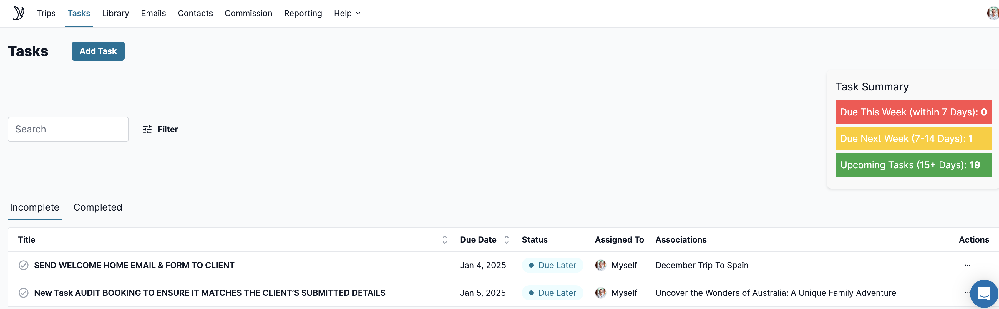

# Tern Travel Plugin

This plugin for the Tern Travel CRM/Itinerary software platform enhances the user experience by automatically summarizing and displaying key information about trips and tasks. It dynamically updates the task summary section with counts of tasks due within specific time frames and provides a visual summary of the number of trips in different statuses. This helps users quickly understand their workload and prioritize tasks effectively.

# Examples

# Disclaimer

This Chrome Extension is not affiliated, associated, nor sponsored by Tern Travel, Inc. 

Any use of this extension is at the sole discretion and risk of the Tern Travel end user. The end user takes full responsibility for protecting their client's information and as such should review the usage and permissions of any such client side installed Browser Extension carefully before using.

# Permission Justifications

This extension does ask for 2 potentially pervasive permissions:

## `activeTab`

The `activeTab` permission is needed to allow the plugin to interact with the currently active tab in the browser. This permission enables the plugin to:

1) Access the content of the active tab to summarize and display key information about trips and tasks.
2) Dynamically update the task summary section with counts of tasks due within specific time frames.
3) Provide a visual summary of the number of trips in different statuses.

Without this permission, the plugin would not be able to access or modify the content of the active tab, which is essential for its functionality.

## `Host`

The `Host` permission is needed to allow the plugin to interact with specific websites or domains. This permission enables the plugin to:

1) Access and manipulate content on the Tern Travel CRM/Itinerary software platform.
2) Retrieve and update trip and task information from the platform.
3) Ensure the plugin can dynamically update the task summary section and provide visual summaries based on the data from the platform.

Without this permission, the plugin would not be able to access the necessary data from the Tern Travel CRM/Itinerary platform, which is essential for its functionality.

# References

[Chrome Web Store Listing](https://chrome.google.com/webstore/detail/<TODO>>)
[Chrome Web Store Developer Dashboard](https://chrome.google.com/u/2/webstore/devconsole/<TODO>/edit)